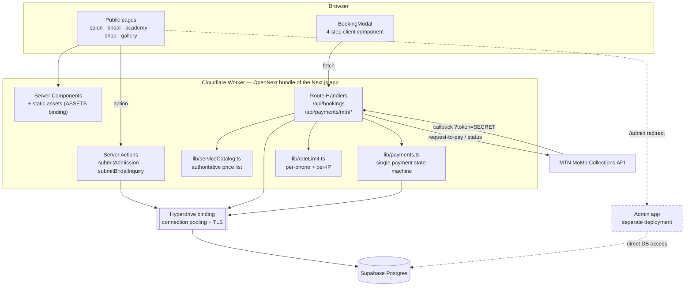
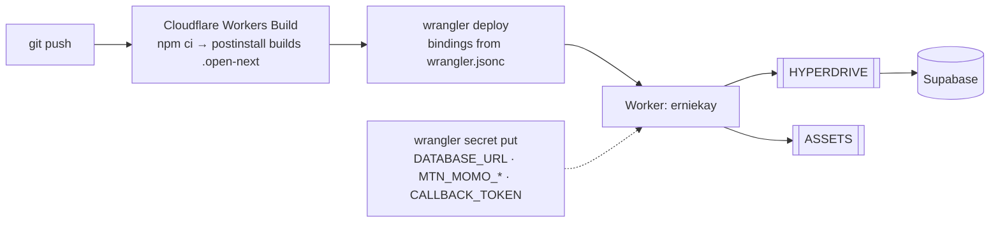
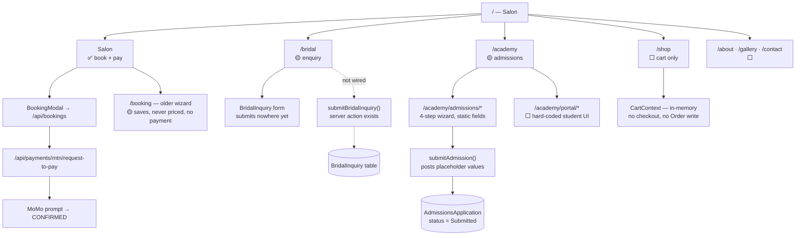
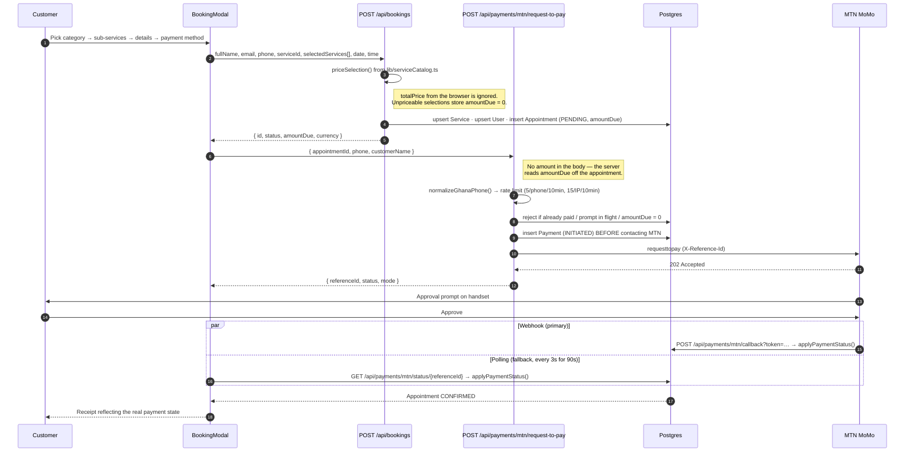
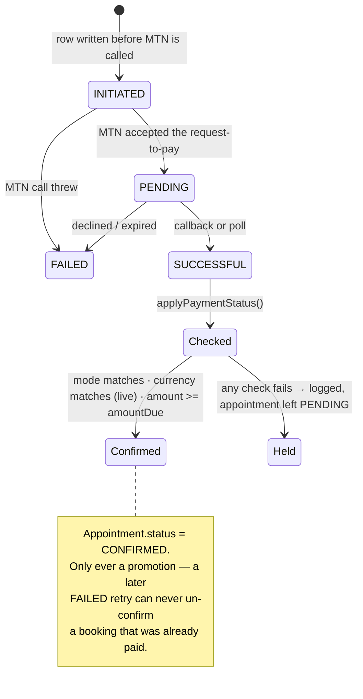
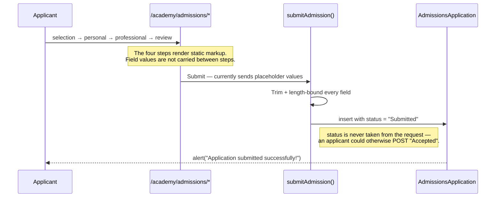
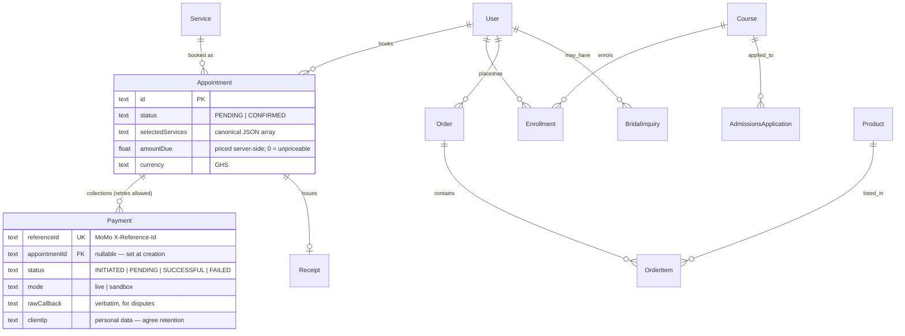
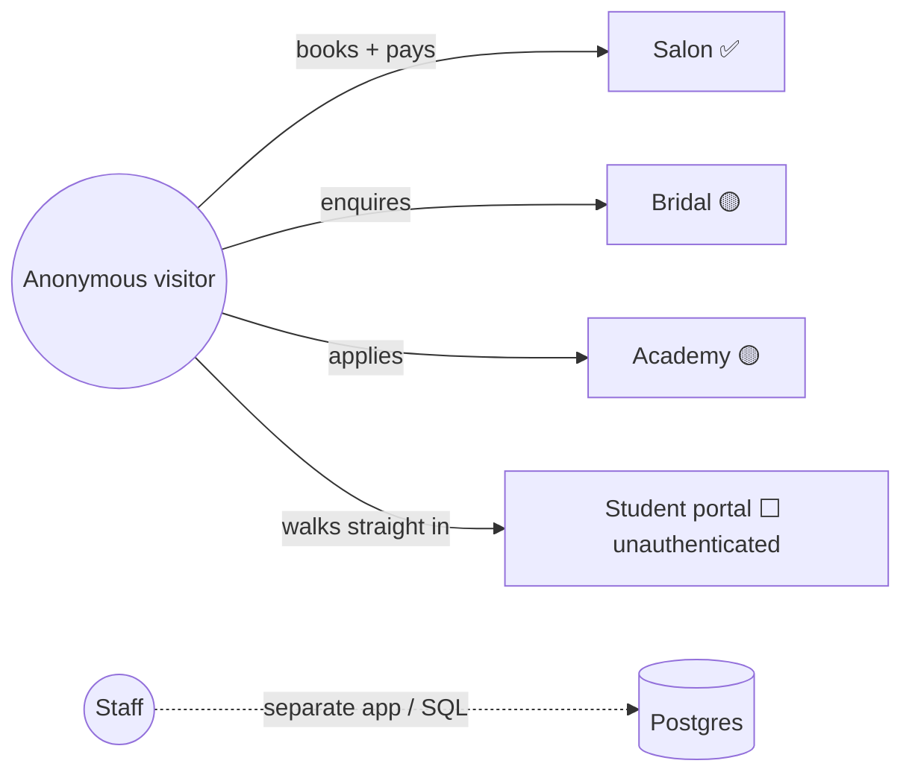
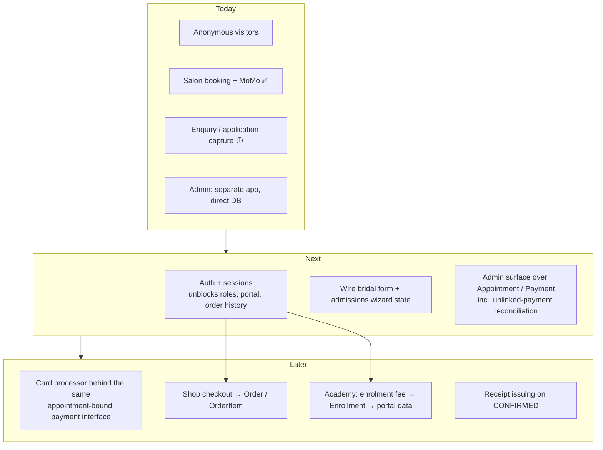

# Erniekay Splendor — System Documentation

Architecture and flow documentation for the Erniekay Splendor platform: one Next.js
application covering the **Salon**, **Bridal** and **Academy** sides of the business,
deployed to Cloudflare Workers.

These diagrams describe **what the code does today**, not a target design. Anything
not yet built is marked and collected under [Gaps and target architecture](#gaps-and-target-architecture).

**Status legend used throughout**

| Badge | Meaning |
| --- | --- |
| ✅ **Live** | Wired end to end — UI → server → database |
| 🟡 **Partial** | Server side exists, UI not connected (or vice versa) |
| ⬜ **Static** | Presentation only; no data layer behind it |

---

## Stack

| Concern | What is actually used |
| --- | --- |
| Framework | Next.js 16 (App Router) — route handlers + server actions, no separate API service |
| Runtime | Cloudflare Workers, bundled by `@opennextjs/cloudflare` (OpenNext) |
| Database | Supabase Postgres, reached **through a Hyperdrive binding** (a Worker cannot open a direct TCP connection to Supabase) |
| Data access | `drizzle-orm` over `postgres.js`, one client per request |
| Payments | MTN MoMo Collections (request-to-pay + callback). Card is a UI option only — no processor |
| Styling | Tailwind v4, EB Garamond + Montserrat via `next/font`, Material Symbols |
| Media | Static files in `/public`, served by the Worker `ASSETS` binding. No Cloudinary |
| Auth | **None.** `User.passwordHash` and `User.role` exist in the schema; nothing reads them |
| Admin | A **separate application**. `/admin` is a redirect to `NEXT_PUBLIC_ADMIN_APP_URL` |

Repository layout: the app lives in [erniekay-splendor/](erniekay-splendor/); this file
documents it.

---

## System Architecture



**Why the pieces sit where they do**

- **No separate API tier.** Route handlers and server actions run inside the same
  Worker as the pages. There is no Express service and no JWT layer between them.
- **Hyperdrive is not optional.** `lib/db.ts` resolves the connection from the
  `HYPERDRIVE` binding on Workers and falls back to `DATABASE_URL` only for `next dev`
  and scripts. The client is created **per request** — a hoisted client throws
  "Cannot perform I/O on behalf of a different request" on the second request in an isolate.
- **Pricing is server-side.** `lib/serviceCatalog.ts` is the only price source. The
  browser never supplies an amount.
- **One payment state machine.** Both the MTN callback and the status-polling route
  funnel into `applyPaymentStatus()`, so the confirmation rule has exactly one implementation.

---

## Deployment and configuration



`wrangler.jsonc` must stay committed: `wrangler deploy` replaces the Worker's bindings
and plain vars with whatever the file contains, so anything set only in the dashboard is
wiped on the next deploy. Secrets are the exception and are managed with `wrangler secret put`.

The callback endpoint **404s until `MTN_MOMO_CALLBACK_TOKEN` is set**, and the URL
registered with MTN must carry `?token=<that value>`.

---

## Surface map



---

## Salon booking and payment ✅

The one flow that runs end to end. The ordering matters and is deliberate: **the booking
is saved before any money is touched**, and the payment is bound to that booking server-side.



**Failure handling built into this flow**

- A MoMo outage no longer discards the booking — the appointment already exists, and the
  receipt step offers a retry.
- Card payments show a receipt with **no reference and no synthetic payment row**, so
  nothing can mistake an unpaid booking for a paid one.
- Failing to write the `Payment` row aborts the collection: the system must never take
  money it has no record of.

### Payment state machine



The callback is idempotent by construction (MTN retries until it gets a 200, and replaying
a terminal status rewrites the same row) and is authenticated only by the shared secret in
the URL, because MoMo does not sign its callbacks.

---

## Bridal enquiry 🟡

Bridal is an **enquiry, not a booking**. Nothing is priced, quoted or charged in code —
the chosen package is a stated preference. The follow-up happens off-platform.

```mermaid
sequenceDiagram
    participant V as Visitor
    participant UI as BridalInquiry form
    participant SA as submitBridalInquiry()
    participant DB as BridalInquiry table
    participant Staff as Staff (off-platform)

    V->>UI: Package, wedding date, venue, party size, aesthetic
    UI--xSA: Not connected yet — the form calls preventDefault()
    Note over UI,SA: The server action is written and validated;<br/>the submit button does not call it.
    SA->>DB: bounded, typed insert (counts validated 0–1000)
    Staff->>DB: reads enquiries, quotes by phone/email
```

There is **no** quotation record, deposit payment or bridal booking table. The README
previously described all three.

---

## Academy admissions 🟡



What does **not** exist: enrolment fees, `Enrollment` writes, instructor accounts,
certificates, and any student login. `/academy/portal/*` is hard-coded UI — the progress
figures, courses and grades on those pages are literals in the JSX, and the pages are
reachable without authenticating.

---

## Data model

Tables as they exist in Supabase (created by an earlier Prisma migration; `lib/schema.ts`
mirrors them). Solid boxes are written by the app today; dashed relationships are modelled
but never populated.



**Written today:** `User`, `Service`, `Appointment`, `Payment`, `AdmissionsApplication`,
and `BridalInquiry` (once the form is wired).
**Modelled but unused:** `Receipt`, `Course`, `Enrollment`, `Product`, `Order`, `OrderItem`.

Schema changes go in `scripts/migrations/*.sql`, applied with `npm run db:migrate`.
Do **not** run `drizzle-kit generate` or `drizzle-kit migrate` — the database predates
this schema file, and a generated diff would disable row level security on every table
and drop `_prisma_migrations`.

---

## Roles

The previous README documented four enforced roles. In the code there is **one actor**:
an anonymous visitor.



`User.role` defaults to `CLIENT` and no code path reads it. Adding roles requires adding
authentication first — see below.

---

## Local development

```bash
cd erniekay-splendor
npm install
npm run dev            # http://localhost:3000, DATABASE_URL from .env

npm run db:check       # smoke-tests every write path inside a rolled-back transaction
npm run db:studio      # drizzle-kit studio
npm run db:migrate     # applies scripts/migrations/*.sql once each

npm run test:mtn           # exercises the MoMo request-to-pay path
npm run test:mtn:callback  # exercises the callback endpoint

npm run build:cf       # produce the .open-next Worker bundle
npm run preview        # run that bundle locally
```

Environment split: `.env` holds `DATABASE_URL` / `DIRECT_URL` (session-mode pooler on 5432 —
transaction mode does not support the prepared statements drizzle-kit uses), `.env.local`
holds the MoMo configuration for `next dev`, and `.dev.vars` holds the same values for the
Workers runtime under `preview`.

---

## Gaps and target architecture

Ordered by what blocks the most downstream work.



| Gap | Consequence today |
| --- | --- |
| No authentication | `/academy/portal/*` is public; no per-customer booking history; roles unenforceable |
| Bridal form not wired to its action | Enquiries submitted on the site are lost |
| Admissions wizard does not carry state | Every application row holds the same placeholder values |
| `/booking` posts uncatalogued service ids | Those bookings store `amountDue = 0` and can never be auto-confirmed — staff settle them manually |
| No card processor | The card option produces an unpaid booking |
| Cart has no checkout | `Product` / `Order` / `OrderItem` stay empty |
| No receipt issuing | `Receipt` stays empty even after a confirmed payment |
| `clientIp` retained indefinitely | Personal data with no agreed retention period |

When adding a second payment provider, keep the shape the MoMo integration established:
**price on the server, bind the payment to an appointment at creation, and route every
status change through `applyPaymentStatus()`.** That is what closed the bypass where a
client could pair a cheap payment with an expensive booking.
