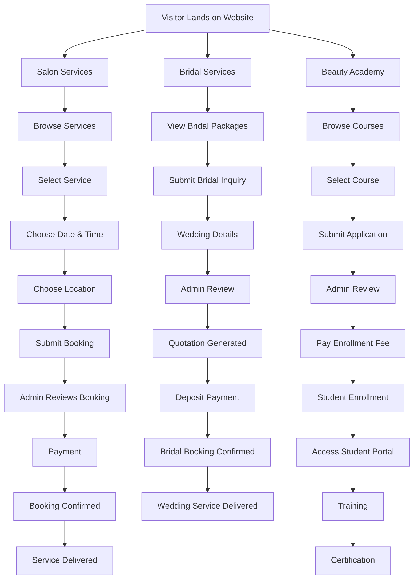
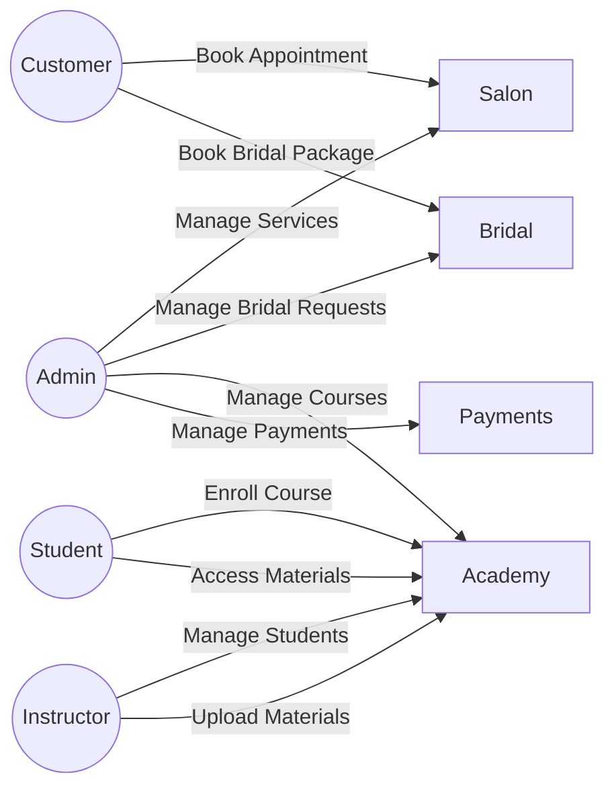
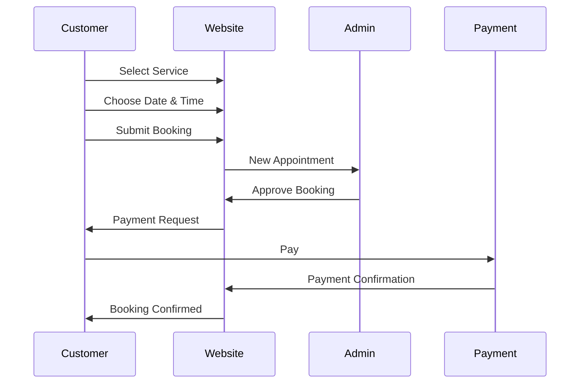
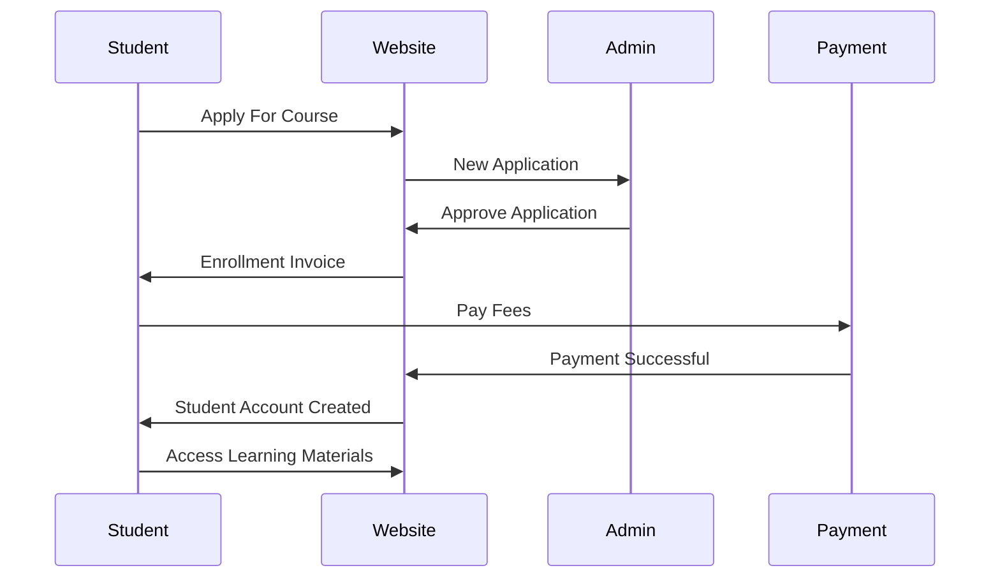
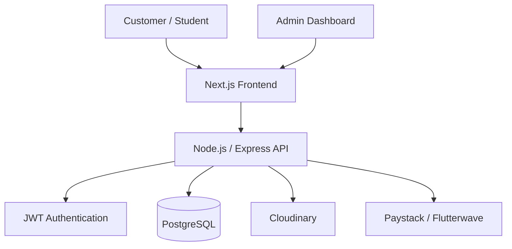
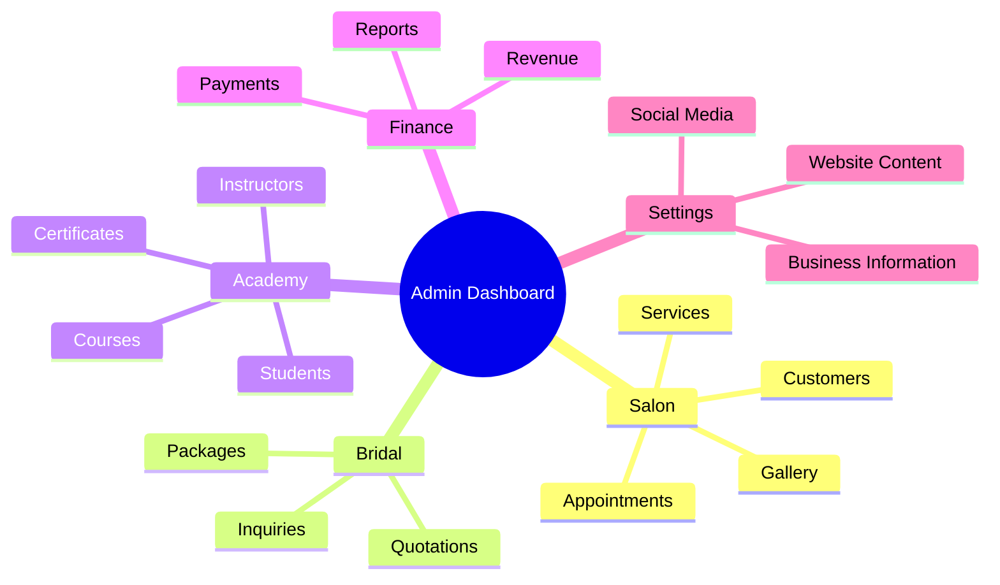

# erniekay Splendor

This set of Mermaid diagrams is suitable for your project's **README, system documentation, software requirements document (SRD), and developer onboarding materials**. It clearly separates the **Salon**, **Bridal**, and **Academy** business processes while keeping everything under a single beautician business.
# Complete System Workflow

---

# User Roles Workflow

---

# Appointment Booking Flow

---

# Academy Enrollment Flow

---

# System Architecture

---

# Admin Dashboard Modules

